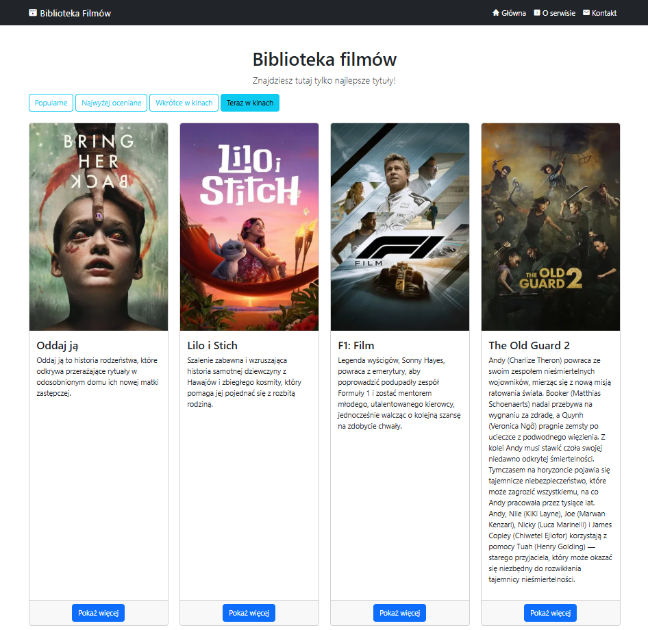

# Biblioteka Filmów

Aplikacja webowa stworzona przy użyciu frameworka Flask, która prezentuje katalog filmów pobieranych z The Movie Database (TMDB) API.

## Zrzut ekranu


## Funkcjonalności

*   **Przeglądanie list filmów**: Możliwość przełączania się między listami: Popularne, Najwyżej oceniane, Wkrótce w kinach i Teraz w kinach.
*   **Szczegóły filmu**: Dedykowana podstrona dla każdego filmu, zawierająca:
    *   Opis i podstawowe informacje.
    *   Galerię zdjęć (tła).
    *   Listę obsady.
    *   Informacje o dostępności na platformach streamingowych w Polsce.
*   **Podstrony statyczne**: "O serwisie" i "Kontakt".

## Użyte technologie

*   **Backend**: Python, Flask
*   **Frontend**: HTML, Bootstrap 5
*   **API**: The Movie Database (TMDB)

## Struktura projektu

```
movies_catalogue/ 
├── static/ 
│ └── css/ 
│ └── main.css 
├── templates/ 
│ ├── index.html # Główny szablon strony 
│ ├── homepage.html # Widok strony głównej 
│ ├── movie_details.html # Widok szczegółów filmu 
│ ├── about.html # Widok podstrony "O serwisie" 
│ └── contact.html # Widok podstrony "Kontakt" 
├── .env # Plik konfiguracyjny (lokalny) 
├── .gitignore # Plik ignorowanych plików Git 
├── main.py # Główny plik aplikacji Flask 
├── tmdb_client.py # Klient do obsługi API TMDB 
├── requirements.txt # Lista zależności projektu 
└── README.md # Ten plik
```

## Instalacja i uruchomienie

1.  **Sklonuj repozytorium:**
    ```bash
    git clone https://github.com/MarcinSachs/movies_catalogue.git
    cd movies_catalogue
    ```

2.  **Stwórz i aktywuj wirtualne środowisko:**
    ```bash
    # Windows
    python -m venv venv
    venv\Scripts\activate
    ```

3.  **Zainstaluj wymagane pakiety:**
    ```bash
    pip install -r requirements.txt
    ```

4.  **Skonfiguruj klucz API:**
    *   Zarejestruj się na [The Movie Database (TMDB)](https://www.themoviedb.org/signup) i uzyskaj klucz API (v4 auth Bearer Token) w ustawieniach swojego konta.
    *   W głównym katalogu projektu (`movies_catalogue/`) utwórz plik o nazwie `.env`.
    *   Dodaj do niego swój token w następującym formacie:
        ```
        TMDB_API_TOKEN="tutaj_wklej_swój_długi_token_okaziciela"
        ```

5.  **Uruchom aplikację:**
    ```bash
    python main.py
    ```
    Otwórz przeglądarkę i przejdź pod adres `http://127.0.0.1:5000/`.
    